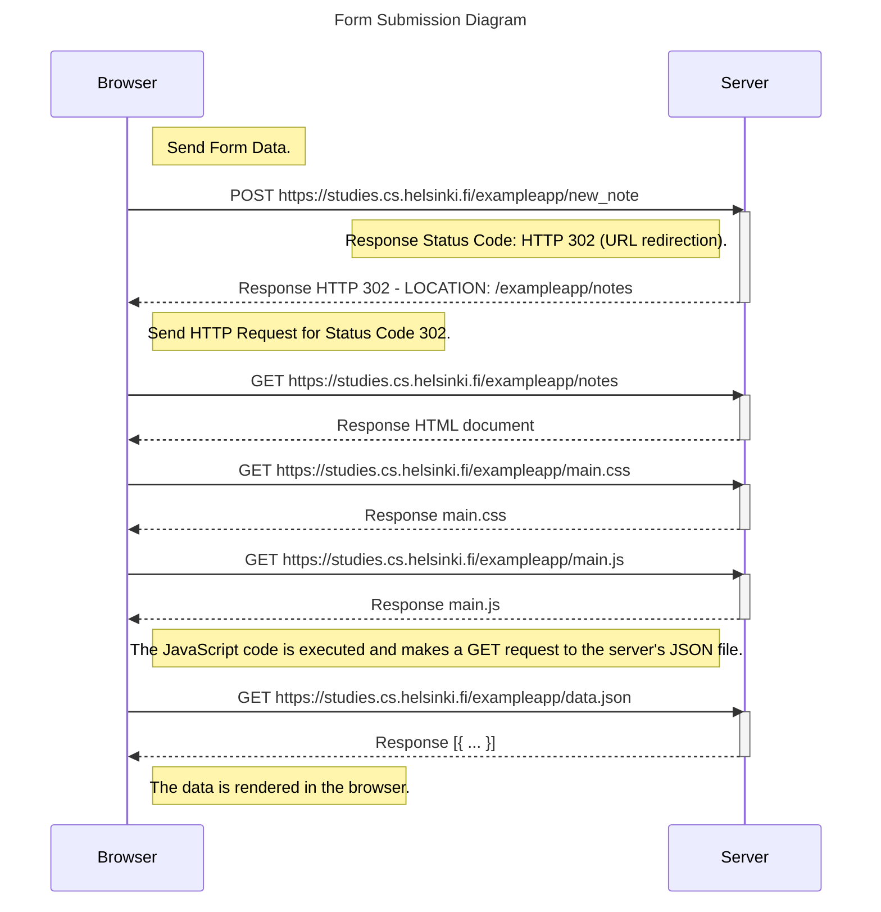

```mermaid
sequenceDiagram
    title Form Submission Diagram
    participant B as Browser
    participant S as Server

    Note right of B: Send Form Data.

    B->>S: POST https://studies.cs.helsinki.fi/exampleapp/new_note
    activate S

    Note left of S: Response Status Code: HTTP 302 (URL redirection).

    S-->>B: Response HTTP 302 - LOCATION: /exampleapp/notes
    deactivate S

    Note right of B: Send HTTP Request for Status Code 302.

    B->>S: GET https://studies.cs.helsinki.fi/exampleapp/notes
    activate S
    S-->>B: Response HTML document
    deactivate S

    B->>S: GET https://studies.cs.helsinki.fi/exampleapp/main.css
    activate S
    S-->>B: Response main.css
    deactivate S

    B->>S: GET https://studies.cs.helsinki.fi/exampleapp/main.js
    activate S
    S-->>B: Response main.js
    deactivate S

    Note right of B: The JavaScript code is executed and makes a GET request to the server's JSON file.

    B->>S: GET https://studies.cs.helsinki.fi/exampleapp/data.json
    activate S
    S-->>B: Response [{ ... }]
    deactivate S

    Note right of B: The data is rendered in the browser.
```