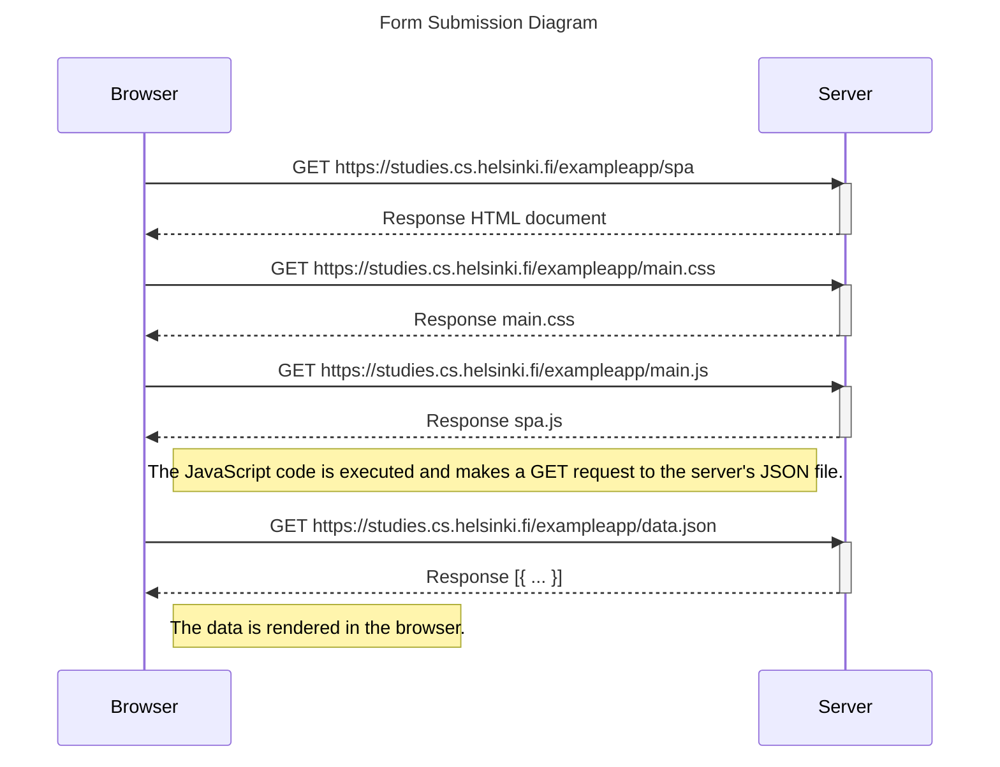

```mermaid
sequenceDiagram
    title Form Submission Diagram
    participant B as Browser
    participant S as Server

    B->>S: GET https://studies.cs.helsinki.fi/exampleapp/spa
    activate S
    S-->>B: Response HTML document
    deactivate S

    B->>S: GET https://studies.cs.helsinki.fi/exampleapp/main.css
    activate S
    S-->>B: Response main.css
    deactivate S

    B->>S: GET https://studies.cs.helsinki.fi/exampleapp/main.js
    activate S
    S-->>B: Response spa.js
    deactivate S

    Note right of B: The JavaScript code is executed and makes a GET request to the server's JSON file.

    B->>S: GET https://studies.cs.helsinki.fi/exampleapp/data.json
    activate S
    S-->>B: Response [{ ... }]
    deactivate S

    Note right of B: The data is rendered in the browser.
```