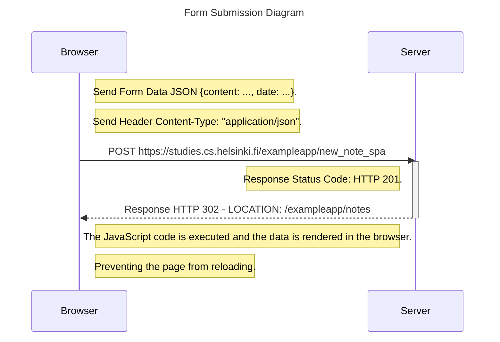

```mermaid
sequenceDiagram
    title Form Submission Diagram
    participant B as Browser
    participant S as Server

    Note right of B: Send Form Data JSON {content: ..., date: ...}.
    Note right of B: Send Header Content-Type: "application/json".

    B->>S: POST https://studies.cs.helsinki.fi/exampleapp/new_note_spa
    activate S

    Note left of S: Response Status Code: HTTP 201.

    S-->>B: Response HTTP 302 - LOCATION: /exampleapp/notes
    deactivate S

    Note right of B: The JavaScript code is executed and the data is rendered in the browser.
    Note right of B: Preventing the page from reloading.
```